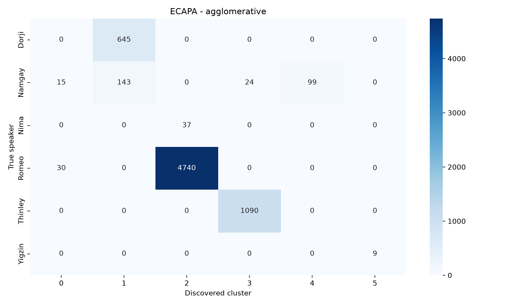
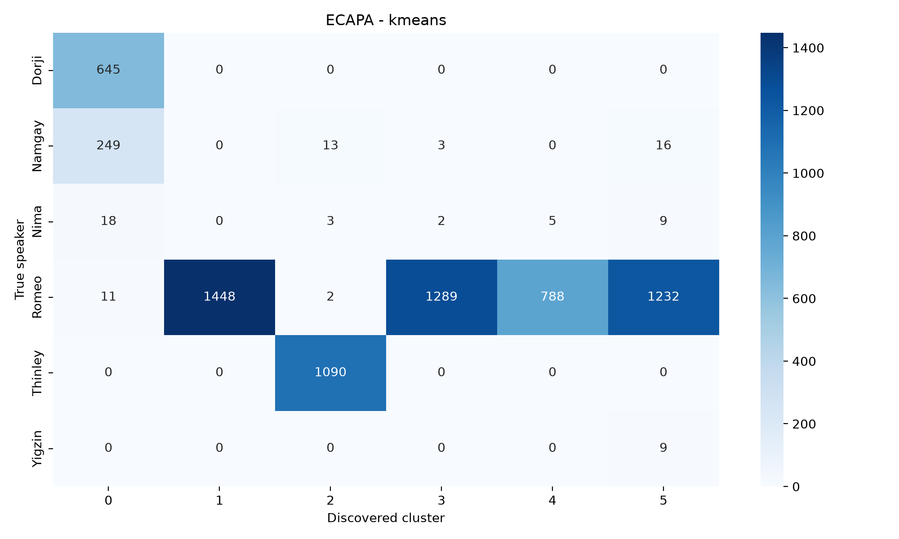
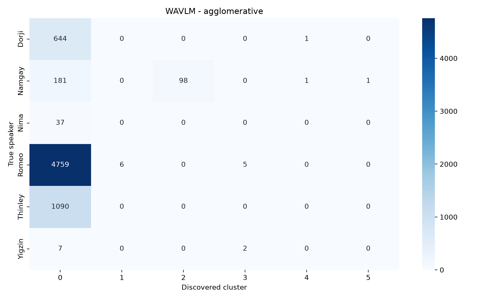
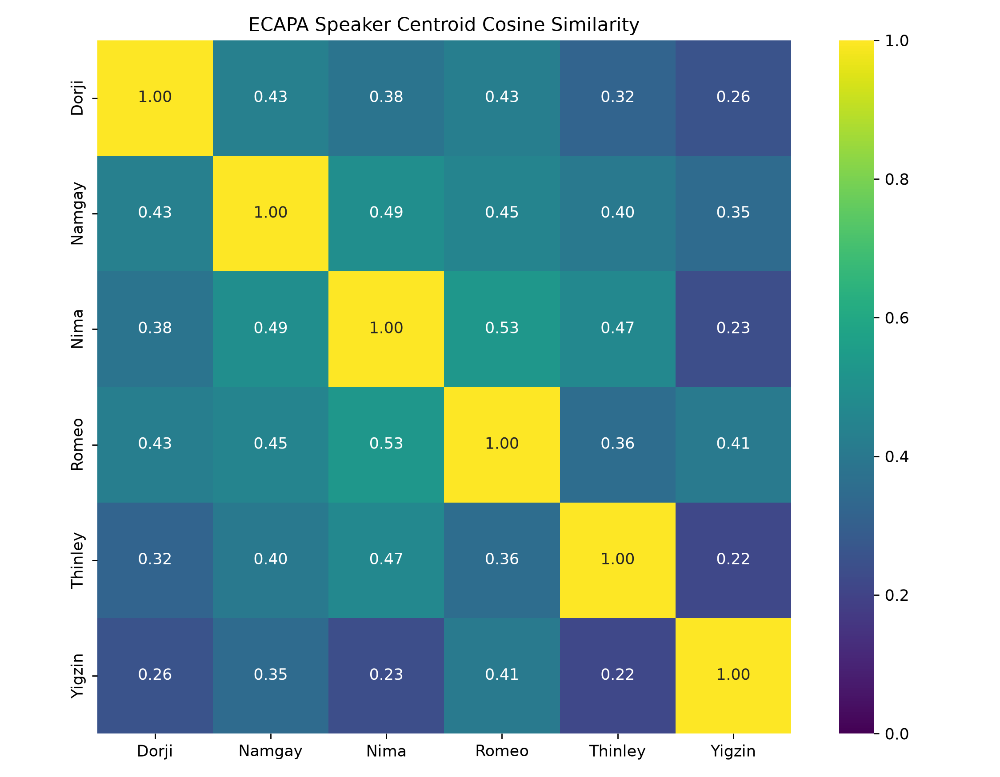
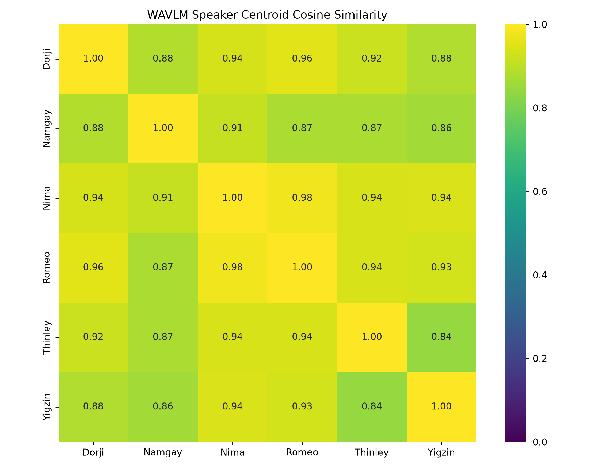
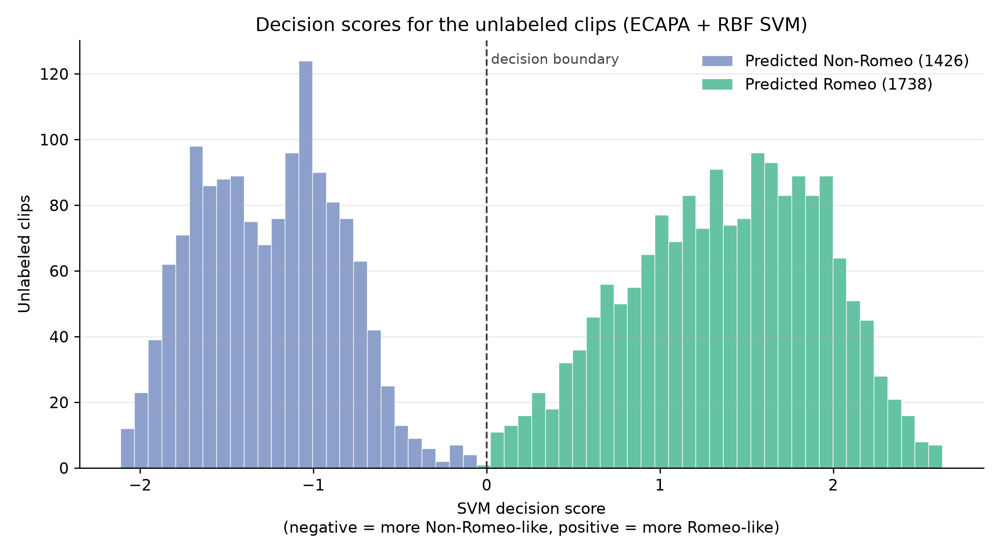

# Recovering speaker identity from partially labeled Dzongkha speech

We were recording spoken Dzongkha at the NoMind office in Motithang. One afternoon, Ugsy (the bossman) decided to add login credentials for each speaker so that we'd know who the speaker was for a given recording. The issue was, by that time the speakers were already done recording half the dataset, so the speaker labels would only be available for the latter half of the dataset. The majority contributor to the speech recordings was one dude, let's call him "Romeo". I want all of Romeo's recordings in one place (so that I can train a TTS model on just his voice later on). 

I'll first extract speaker embeddings and then use these embeddings for:
- Supervised speaker identification (classification)
- Unsupervised speaker identification (clustering)
- Speaker embedding visualization with LDA and UMAP
- Identifying likely Romeo recordings from the unlabeled clips


## Step 1: Extract speaker embeddings
I used pretrained models to extract a speaker embedding for each recording. I used two models: WavLM Base+ [[1]](#ref-1) and ECAPA-TDNN [[2]](#ref-2). <br>
The `microsoft/wavlm-base-plus-sv` and `speechbrain/spkrec-ecapa-voxceleb` models are used only as feature extractors. <br>

For embeddings extracted from both models, each embedding is L2-normalized, and then all embeddings are saved as an npy file, a multi-dimensional numpy array of shape `(9996, 192)` for ECAPA-TDNN, and `(9996, 512)` for WavLM. <br>
We have 9996 recorded clips. For each recording, ECAPA-TDNN produces an embedding vector of length 192, and WavLM produces an embedding vector of length 512. <br>
An index csv also saved for each npy file, containing the fields: `audio_id`, `split` (labeled|unlabeled), `speaker`.

Extracting embeddings for each recording provides a common representation for every recorded clip. This can then be used for visualization, clustering, and classification. 


## Step 2: Supervised speaker identification (classification)
Only the labeled half of the dataset is used here: 6832 of the 9996 clips. The speaker counts are heavily skewed, which matters for how the results below should be read:

| Speaker | Clips |
| --- | --- |
| Romeo | 4770 |
| Thinley | 1090 |
| Dorji | 645 |
| Namgay | 281 |
| Nima | 37 |
| Yigzin | 9 |

The labeled clips are split 75/25 into train and test with `random_state=42`, stratified on the labels, giving 5124 training and 1708 test clips. <br>
Five classifiers are trained on each of the two embedding sets: logistic regression, linear SVM, RBF SVM, k-nearest neighbours (k=5, cosine distance, distance-weighted), and a 300-tree random forest. Every model except kNN uses `class_weight="balanced"` to offset the skew. <br>
No scaling is applied, since the embeddings are already L2-normalized in Step 1.

Each run writes a classification report and a confusion matrix to `trained_models/{binary|multiclass}/{embedding}/{model}/`.


### A. Binary classification
Romeo vs Non-Romeo. This collapses the five other speakers into one class, leaving 3576 Romeo and 1548 Non-Romeo clips for training.

```sh
python 2a_train_binary.py ecapa
python 2a_train_binary.py wavlm
```

| Embedding | Model | Accuracy | Balanced accuracy | ROC-AUC | Errors (of 1708) |
| --- | --- | --- | --- | --- | --- |
| ECAPA | Logistic regression | 0.9977 | 0.9983 | 0.99998 | 4 |
| ECAPA | Linear SVM | 0.9994 | 0.9996 | 1.00000 | 1 |
| ECAPA | **RBF SVM** | **1.0000** | **1.0000** | **1.00000** | **0** |
| ECAPA | **kNN** | **1.0000** | **1.0000** | **1.00000** | **0** |
| ECAPA | Random forest | 0.9977 | 0.9978 | 0.99996 | 4 |
| WavLM | Logistic regression | 0.9655 | 0.9643 | 0.99186 | 59 |
| WavLM | Linear SVM | 0.9807 | 0.9796 | 0.99585 | 33 |
| WavLM | RBF SVM | 0.9836 | 0.9828 | 0.99842 | 28 |
| WavLM | kNN | 0.9789 | 0.9679 | 0.99137 | 36 |
| WavLM | Random forest | 0.9813 | 0.9778 | 0.99684 | 32 |

Telling Romeo apart from everyone else is close to trivial on ECAPA embeddings. Both the RBF SVM and kNN get a perfect confusion matrix, and the linear SVM misses a single clip out of 1708. Every ECAPA model clears 99.7%. <br>
WavLM is consistently worse, its best model landing at 98.4% with 28 errors.


### B. Multi-class classification
All six speakers as separate classes.

```sh
python 2b_train_multiclass.py ecapa
python 2b_train_multiclass.py wavlm
```

| Embedding | Model | Accuracy | Balanced accuracy | Macro F1 | Weighted F1 |
| --- | --- | --- | --- | --- | --- |
| ECAPA | Logistic regression | 0.9971 | 0.9993 | **0.9939** | 0.9971 |
| ECAPA | Linear SVM | 0.9988 | 0.9813 | 0.9889 | 0.9988 |
| ECAPA | RBF SVM | **0.9994** | 0.9815 | 0.9901 | 0.9994 |
| ECAPA | kNN | **0.9994** | 0.9815 | 0.9901 | 0.9994 |
| ECAPA | Random forest | 0.9953 | 0.7222 | 0.7494 | 0.9939 |
| WavLM | Logistic regression | 0.9537 | 0.9257 | 0.7131 | 0.9636 |
| WavLM | Linear SVM | 0.9608 | 0.8840 | 0.7393 | 0.9687 |
| WavLM | RBF SVM | 0.9766 | 0.8497 | 0.7915 | 0.9793 |
| WavLM | kNN | 0.9766 | 0.7161 | 0.7514 | 0.9737 |
| WavLM | Random forest | 0.9819 | 0.7555 | 0.7960 | 0.9799 |

The test set contains 1193 Romeo, 273 Thinley, 161 Dorji, 70 Namgay, 9 Nima, and 2 Yigzin clips. With Romeo making up 70% of it, plain accuracy is a poor summary. Macro F1 and balanced accuracy weight every speaker equally, and that is where the models come apart.

ECAPA's RBF SVM and kNN reach the highest accuracy at 99.94%, both missing only one Nima clip. Logistic regression is marginally lower on accuracy but has the best macro F1 at 0.994, because it is the only model that classifies all 9 Nima clips correctly. <br>
The random forest is the outlier: 99.53% accuracy, but macro F1 of just 0.749. It scores 0.00 on Yigzin and 0.50 on Nima, sending 6 of 9 Nima clips and both Yigzin clips to Romeo. A 300-tree forest with `class_weight="balanced"` still cannot learn a class with 7 training examples.

WavLM is worse across the board, and worse in a more damaging way. Its accuracy looks respectable at 95–98%, but macro F1 never exceeds 0.796. Nima's F1 ranges from 0.00 (kNN) to 0.38 (RBF SVM), and Yigzin's from 0.20 to 0.67. Under WavLM the two smallest speakers are effectively unrecoverable.

> Note: Yigzin has 9 clips in total, so the 75/25 split leaves 7 for training and 2 for testing. Nima has 37, giving 28 and 9. Per-class scores for these two speakers are computed over a handful of clips and should be read as an indication, not a measurement.

ECAPA-TDNN is clearly the better representation for this dataset, on both tasks and every metric. Step 4 shows why.


## Step 3: Unsupervised speaker identification (clustering)
The same 6832 labeled clips are used, but the labels are now held back and only used for evaluation. The question is whether speaker identity falls out of the embedding space on its own.

```sh
python 3_train_unsupervised.py ecapa
python 3_train_unsupervised.py wavlm
```

Three methods are run on each embedding set:
- **KMeans**, told to find 6 clusters
- **Agglomerative clustering** (average linkage, cosine distance), also told to find 6 clusters
- **HDBSCAN** (`min_cluster_size=5`), which decides its own cluster count and labels low-density points as noise

KMeans and agglomerative clustering are handed the true speaker count, so they are being asked "given that there are 6 speakers, can you partition the clips correctly?" HDBSCAN is not given that hint, and is answering the harder question: "how many speakers are there?"

Results are written to `trained_models/unsupervised/{embedding}/{method}/`.

> Note: The embeddings are L2-normalized, so Euclidean and cosine distance induce the same ordering of neighbours. KMeans is Euclidean by necessity (it has no metric option), agglomerative clustering uses cosine, and HDBSCAN uses Euclidean. On unit vectors these are equivalent up to a monotone transform, so the metric choice is not what separates the methods below. The silhouette score is computed with cosine distance in all three cases.


### Metrics
- **ARI** (adjusted Rand index): agreement between clusters and true speakers, corrected for chance. 0 is random, 1 is perfect.
- **Homogeneity**: are clusters pure? High means each cluster contains one speaker.
- **Completeness**: is each speaker kept together? High means one speaker is not split across clusters.
- **NMI / V-measure**: the harmonic mean of the two above.
- **Silhouette**: cluster separation judged without labels. Note that this measures geometry only, and says nothing about whether the clusters correspond to speakers.


### Results

| Embedding | Method | Clusters | Noise | ARI | NMI | Homogeneity | Completeness | Silhouette |
| --- | --- | --- | --- | --- | --- | --- | --- | --- |
| ECAPA | KMeans | 6 | 0 | 0.277 | 0.578 | 0.837 | 0.441 | 0.154 |
| ECAPA | **Agglomerative** | 6 | 0 | **0.960** | **0.903** | 0.885 | **0.921** | 0.278 |
| ECAPA | HDBSCAN | 13 | 342 | 0.897 | 0.857 | **0.946** | 0.783 | 0.244 |
| WavLM | KMeans | 6 | 0 | 0.272 | 0.458 | 0.628 | 0.361 | 0.231 |
| WavLM | Agglomerative | 6 | 0 | 0.059 | 0.100 | 0.055 | 0.547 | 0.466 |
| WavLM | HDBSCAN | 2 | 17 | 0.058 | 0.096 | 0.053 | 0.537 | 0.788 |


### Agglomerative clustering on ECAPA recovers the speakers
ARI of 0.960 with no labels at all.

<p align="center">
    
</p>

Dorji, Thinley and Yigzin each land in a single cluster, and Yigzin's is pure despite having only 9 clips. Romeo is 4740 of 4770 in one cluster. <br>
Two things go wrong. Nima's 37 clips are absorbed into Romeo's cluster, and Namgay is torn into four pieces (143, 99, 24, 15). Namgay fragmenting is a pattern that recurs under HDBSCAN too.


### KMeans fragments the dominant speaker
KMeans performs almost identically badly on both embeddings, and for the same reason. Its homogeneity is high (0.837 on ECAPA) while completeness is low (0.441) — the clusters it finds are pure, but each speaker is split across several of them.

<p align="center">
    
</p>

Romeo's 4770 clips are spread over four clusters of 1448, 1289, 1232 and 788.

This is what KMeans does when one class holds 70% of the data. It prefers clusters of roughly equal size and variance, so given 6 centroids it spends four of them subdividing Romeo rather than isolating the small speakers. The true structure here is six wildly unbalanced groups, which is exactly the shape KMeans is worst at.


### WavLM collapses into a single blob
Agglomerative clustering on WavLM puts 6718 of the 6832 clips into one cluster.

<p align="center">
    
</p>

Homogeneity of 0.055 says that cluster is a mixture of everyone. HDBSCAN reaches the same conclusion independently, finding just 2 clusters: the same giant blob, plus 97 Namgay clips. Both land at ARI ≈ 0.06, barely above chance.

The centroid similarities in Step 4 explain this. WavLM places every speaker's centroid within cosine 0.84–0.98 of every other, so there are no density gaps to cluster along. The supervised models in Step 2 still reached 95–98% accuracy on WavLM, but they were being told where the boundaries are. Without labels, there is nothing to find.


### Silhouette score is actively misleading here
The two worst clusterings by ARI have the two *highest* silhouette scores: WavLM HDBSCAN at 0.788 (ARI 0.058) and WavLM agglomerative at 0.466 (ARI 0.059). Meanwhile ECAPA's best clustering scores 0.278.

Silhouette only asks whether points sit closer to their own cluster than to neighbouring ones. One enormous cluster and one small satellite scores wonderfully by that standard while telling you nothing about speakers. It is worth reporting, but not worth trusting as a model-selection criterion when labels are available.


### Summary
Speaker identity is recoverable from ECAPA embeddings without any labels, provided the clustering method suits the data: average-linkage agglomerative clustering reaches ARI 0.960, and HDBSCAN reaches 0.897 while also discovering roughly the right structure on its own. KMeans fails on both embeddings because of the class imbalance rather than the representation. WavLM does not support unsupervised speaker identification on this dataset at all.


## Step 4: Embedding visualization
The embeddings live in 192 or 512 dimensions, so seeing them requires projecting down to 3. All 9996 clips are projected, labeled and unlabeled together, so the unlabeled half can be seen in relation to the known speakers.

```sh
python 4_visualize_embeddings.py ecapa
python 4_visualize_embeddings.py wavlm
```

Two projections are used, which answer different questions:

- **LDA** (linear discriminant analysis) is *supervised*. It is fitted on the labeled clips only, and finds the directions that best separate the six known speakers. The unlabeled clips are then projected into that same learned space. This shows how well the speakers can be separated, and where the unlabeled recordings fall relative to them. With 6 classes, LDA yields at most 5 components; the first 3 are used.
- **UMAP** is *unsupervised*, and never sees the labels. It preserves local neighbourhood structure, so clips that are near each other in the original space stay near each other. This shows what structure exists in the embeddings on their own terms.

Outputs go to `visualizations/{embedding}/`: two interactive 3-D plots as HTML, a centroid similarity heatmap, and `embedding_coordinates.csv` containing all six projected coordinates for every clip.

> Note: GitHub will not render the HTML files inline. Download them and open in a browser to rotate, zoom, and hover for audio IDs. Each plot has checkboxes to toggle the labeled and unlabeled points independently.


### Speaker centroid cosine similarity
This is the clearest single result in the project. For each speaker, the mean of their embeddings is taken and normalized, then all pairs of centroids are compared by cosine similarity.

<p align="center">
    
</p>

<p align="center">
    
</p>

| | ECAPA | WavLM |
| --- | --- | --- |
| Off-diagonal range | 0.216 – 0.528 | 0.841 – 0.980 |
| Most similar pair | Nima / Romeo (0.528) | Nima / Romeo (0.980) |
| Least similar pair | Thinley / Yigzin (0.216) | Thinley / Yigzin (0.841) |

ECAPA spreads the speakers apart: no two centroids sit above cosine 0.53, and most are between 0.2 and 0.45. WavLM compresses all six into a narrow band between 0.84 and 0.98 — Romeo and Nima are at 0.980, Romeo and Dorji at 0.956. Under WavLM every speaker points in nearly the same direction.

This one figure explains both of the previous steps. It is why the supervised classifiers in Step 2 do better on ECAPA, and it is why unsupervised clustering in Step 3 works on ECAPA and fails completely on WavLM: there are no gaps between WavLM's speakers for a clustering algorithm to find. A supervised model can still carve boundaries through a crowded space when it is told where they are. Clustering cannot.

Interestingly, both embeddings agree on *which* speakers are most and least alike — Nima is closest to Romeo and Thinley is furthest from Yigzin in both. WavLM is encoding the same relationships, just at a far smaller scale relative to everything else it encodes.


### LDA projection
The first three discriminants capture almost all of the between-speaker variance:

| Embedding | LD1 | LD2 | LD3 | Cumulative |
| --- | --- | --- | --- | --- |
| ECAPA | 0.593 | 0.287 | 0.101 | 0.982 |
| WavLM | 0.560 | 0.250 | 0.164 | 0.974 |

Both are above 97%, so the 3-D plots lose very little of what separates the speakers. <br>
Note that high explained variance here does not mean the speakers are well separated — it means whatever separation exists is captured by these three axes. ECAPA and WavLM look similar by this metric while being very different in practice, which is why the centroid similarities above are the more informative measurement.

Because LDA is fitted on labeled clips only, the position of an unlabeled clip in this space is a direct visual statement about which known speaker it resembles. Toggling the labeled points off in `lda_3d.html` shows the unlabeled clips alone, and on ECAPA the bulk of them sit inside Romeo's region.


### UMAP projection
UMAP never sees the labels, so colouring its output by speaker is a test rather than a construction. On ECAPA the speakers form visibly distinct neighbourhoods, which is consistent with agglomerative clustering reaching ARI 0.960 in Step 3. On WavLM they overlap heavily.

> Note: UMAP is run with `random_state=42` for reproducibility, which forces single-threaded execution and makes it the slowest part of this script.


## Step 5: Identify and assign likely Romeo recordings from unlabeled clips
This is what the whole project was for. The 3164 unlabeled clips are the ones recorded before login credentials were added, and the goal is to pull Romeo's out of that pile.

```sh
python 5_classify.py
```

Unlike the earlier scripts this one takes no arguments — the choices are fixed based on Steps 2 to 4:
- **ECAPA embeddings**, which beat WavLM on every metric in every step
- **RBF SVM**, `class_weight="balanced"`, which reached a perfect confusion matrix on the held-out binary task
- **Trained on all 6832 labeled clips**, not the 75% training split. Step 2 exists to choose a model; here there is no need to hold data back, so all of it is used

The fitted model is saved to `trained_models/final/ecapa_rbf_svm.joblib`. Each unlabeled clip is then classified, and its WAV is copied into `classified/romeo/` or `classified/non_romeo/`. A `predictions.csv` is written alongside, containing every clip's `audio_id`, predicted label, and SVM `decision_score`, sorted from most to least Romeo-like.


### Results

| | Clips |
| --- | --- |
| Predicted Romeo | 1738 |
| Predicted Non-Romeo | 1426 |
| Total unlabeled | 3164 |

<p align="center">
    
</p>

Decision scores range from **+2.630** to **−2.112**, and the distribution is strongly bimodal. 1282 clips score above +1 and 1020 below −1, so 73% of the unlabeled set falls in a region the model is confident about. Only **53 clips** sit within ±0.25 of the decision boundary, and just 15 within ±0.1. The model is not hedging: it sees two well-separated groups, which is what the centroid separation in Step 4 would predict.

Because the output is sorted by `decision_score`, the ambiguous clips are easy to find — they are the rows either side of where the label flips, between `decision_score` +0.014 and −0.034. Those are the ones worth listening to by hand.

> Note: Romeo accounts for 55% of the unlabeled clips (1738/3164) but 70% of the labeled ones (4770/6832). The recording sessions were not evenly distributed across speakers over time, so this difference is expected rather than a sign of a problem.


### What this does and does not tell us
The binary classifier scored a perfect confusion matrix in Step 2, but that was on held-out clips from the *labeled* half. There is no ground truth for the unlabeled half, so these 1738 assignments are unverified.

The more important limitation is that the classifier only knows two things: Romeo, and the five other speakers it was trained on. If anyone contributed to the unlabeled recordings who never appears in the labeled half — which is entirely possible, since the labels only started partway through — the model has no category for them. It will force every such clip into Romeo or Non-Romeo, and a genuinely unknown speaker whose voice happens to resemble Romeo's will be filed as Romeo.

Step 3 offers a partial check on this. HDBSCAN on ECAPA found 13 clusters among the labeled clips rather than 6, so there is more structure in this data than the 6 labels describe. Running the clustering over the full 9996 clips, including the unlabeled ones, would reveal whether the unlabeled half contains groups that sit apart from all six known speakers.

For the intended purpose — collecting a single-speaker corpus for TTS training — the practical response is to favour precision over recall. Rather than taking all 1738 predicted clips, taking only those above a higher threshold (say `decision_score > 1.0`, giving 1282 clips) trades some of Romeo's recordings for greater confidence that no other voice has crept in. `predictions.csv` is sorted to make exactly that cut easy.


## Notes
The dataset is not included in this repository (Ugsy would not approve of me open-sourcing the dataset). The embeddings are included though. 


## References

<a id="ref-1"></a>
[1] S. Chen et al., "WavLM: Large-Scale Self-Supervised Pre-Training for Full Stack Speech Processing," 2021. https://arxiv.org/abs/2110.13900
<br> Microsoft, "WavLM Base Plus for Speaker Verification". https://huggingface.co/microsoft/wavlm-base-plus-sv

<a id="ref-2"></a>
[2] B. Desplanques, J. Thienpondt, and K. Demuynck, "ECAPA-TDNN: Emphasized Channel Attention, Propagation and Aggregation in TDNN Based Speaker Verification," 2020. https://arxiv.org/abs/2005.07143
<br> SpeechBrain, "ECAPA-TDNN Speaker Recognition Model trained on VoxCeleb." https://huggingface.co/speechbrain/spkrec-ecapa-voxceleb
